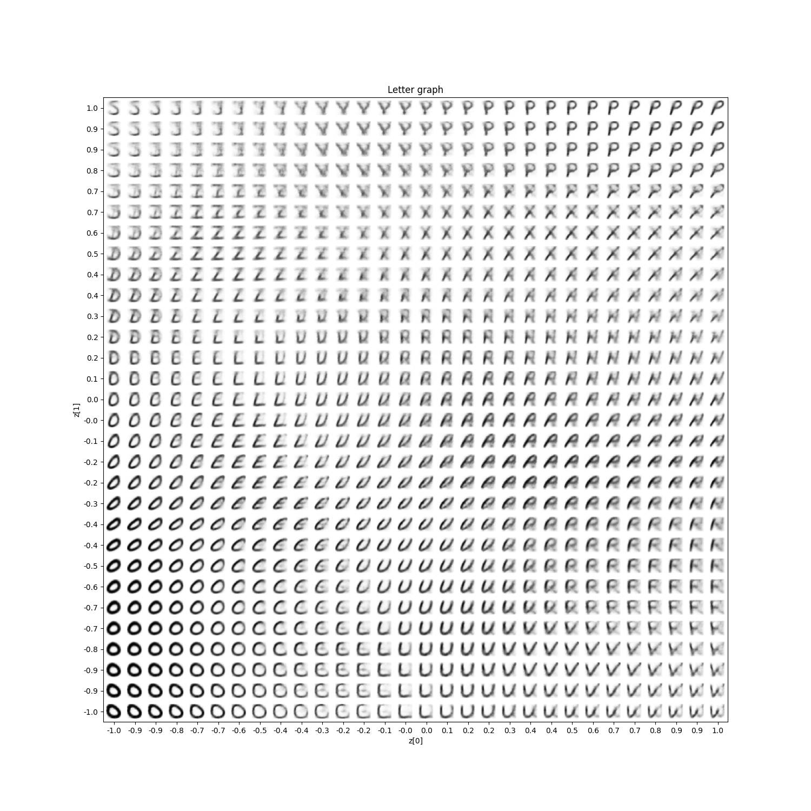

# Handwritten-Characters-VAE
This is my first attempt at creating an image generator.  
I've decided to use a VAE model, due to its short training time and interesting results it produces. 

## Dataset

The dataset used for this project is available at [Kaggle](https://www.kaggle.com/datasets/sachinpatel21/az-handwritten-alphabets-in-csv-format).

## Result

Here is the latent space graph of trained VAE model:

As we can see, there are some letters that are missing (for example 'm'), and many others are hard to recognize.  
